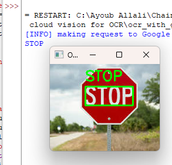

# OCR With Google Cloud Vision API And Python
 
For more information visit our instagram : https://www.instagram.com/python_a_a/

# Input :

# Output :

# Steps :
Select or create a Google Cloud Platform project.

Enable Cloud Vision API for your project.

Create a service account and get your JSON credentials. 